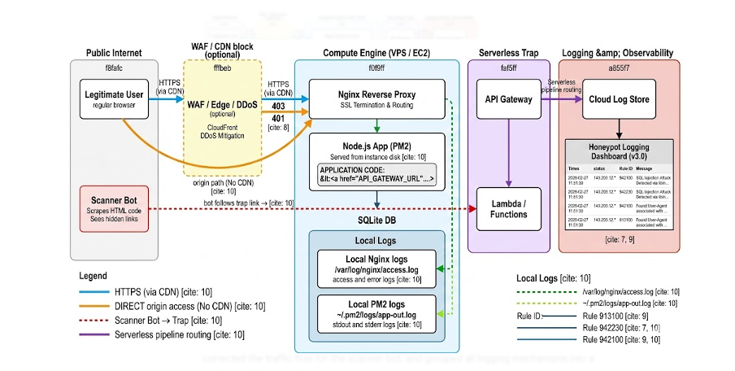

# ProtectTheHoney (https://hdtvstreams.com)


ProtectTheHoney is an adaptive cybersecurity project that attempts to combine honeypot deception with machine learning clustering algorithms to create a self-learning defense system. ProtectTheHoney continuously learns from attacker interactions and adapts its defense strategies turning a passive honeypot into an intelligent, evolving security mechanism.



---

## How it works end-to-end

1. **Attacker hits the site** → nginx logs the request
2. **GCP VM runs a cron job every 5 minutes** → reads new log lines, groups them into 5-minute windows per IP, extracts features
3. **HDBSCAN model assigns each window to a known attack cluster** (e.g. `.env harvesting`, `WordPress exploitation`, `PHPUnit RCE`)
4. **Windows too far from any cluster become noise (-1)** — likely novel or unknown attacks
5. **A rollup JSON is generated** summarising what's happening and which IPs are responsible
6. **An LLM (GPT-class model via HuggingFace)** reads the rollup and writes Cloudflare WAF rules → rules are pushed via the Cloudflare API
7. **Login attempts on the fake site** are captured by an AWS Lambda function for credential analysis

---

## Project structure

```
ProtectTheHoney/
│
├── Website/
│   ├── Index.html                  # The honeypot landing page (fake streaming site)
│   ├── login.html                  # Fake login page — captures credentials
│   ├── admin.html                  # Fake admin panel
│   ├── backend/
│   │   ├── index.js                # Express API: handles /register, /login, /users
│   │   └── db.js                   # SQLite database setup
│   └── frontend/                   # React + Vite + Tailwind + shadcn/ui frontend
│       └── src/
│           ├── main.tsx            # App entry point
│           ├── pages/              # Page components
│           └── components/         # UI components (shadcn/ui)
│
├── Lambda/
│   └── lambda_function.py          # AWS Lambda: captures POST bodies (username/password) from login attempts
│
├── Machine Learning/
│   ├── HDBSCAN.ipynb               # Main model training notebook — trains the clustering model on nginx logs
│   ├── Kmeans.ipynb                # Earlier K-means experiment (superseded by HDBSCAN)
│   ├── drift_analysis.ipynb        # Measures how much attack patterns have shifted since training
│   ├── pipeline.py                 # Local version of the feature engineering pipeline
│   │
│   ├── GCP-VM-Pipeline /           # Code that runs on the GCP instance (note: folder has a trailing space)
│   │   ├── pipeline.py             # Parses nginx logs → 5-min windows → feature matrix
│   │   └── run_batch.py            # Cron entry point: reads new log lines, runs inference, writes rollup JSON
│   │
│   ├── Trained-model Artifacts/    # Saved model files (joblib) — copied to GCP instance for inference
│   │   ├── hdbscan.joblib          # Trained HDBSCAN model
│   │   ├── tfidf.joblib            # TF-IDF vectoriser fitted on URL paths
│   │   ├── scaler.joblib           # StandardScaler for numeric features
│   │   ├── num_cols.joblib         # List of numeric column names (keeps features aligned at inference time)
│   │   ├── nn_index.joblib         # Cosine nearest-neighbour index (assigns new windows to clusters)
│   │   └── labels_train.joblib     # Cluster label for each training window
│   │
│   └── LLM/
│       └── llm-testing.ipynb       # Experiments with LLM-driven WAF rule generation via HuggingFace
│
├── Simulate Cyber-Attacks/
│   └── rate_limit tests/
│       ├── locust_load.py          # Locust load test — simulates up to 500 concurrent users in steps
│       └── curl_cffi_script.py     # Mimics browser TLS fingerprints to bypass bot detection
│
└── README.md
```

---

## The machine learning bit

The model was trained on real nginx access logs from the honeypot. Each IP's requests are grouped into 5-minute windows, then features are extracted:

- How many requests did they make?
- How many unique paths did they hit?
- What's the ratio of 404s, 403s, 401s, 429s, 500s?
- What paths did they request? (TF-IDF encoded)

HDBSCAN clusters these windows. The resulting 14 clusters each map to a recognisable attack pattern:

| Cluster | What it is |
|---------|------------|
| 0, 3 | `.env` file harvesting (secrets discovery) |
| 1, 8, 9, 12, 13 | WordPress exploitation / admin enumeration |
| 2 | IoT device default login scanning |
| 4, 5, 6, 10 | Generic login / credential stuffing |
| 7 | Swagger / OpenAPI docs enumeration |
| 11 | PHPUnit RCE probing (`eval-stdin.php`) |
| -1 | Noise — doesn't fit any known pattern |

At inference time, new windows are assigned to the nearest cluster using a cosine nearest-neighbour index. Windows that are too far from everything get labelled as noise (-1), which typically means a novel or one-off attack.

---

## On-instance setup (GCP VM)

The production inference pipeline lives at `/opt/honey/pipeline/` on the GCP VM:

- `pipeline.py` — feature engineering (same logic as the training notebook)
- `run_batch.py` — reads new nginx lines since the last run, runs inference, writes a rollup JSON to `/opt/honey/results/`

A cron job runs `run_batch.py` every 5 minutes. The log file offset is saved in `/opt/honey/state/` so the same lines are never processed twice.

---

## Retraining the model

If attack patterns drift (check with `drift_analysis.ipynb`), retrain like this:

1. Run `Machine Learning/HDBSCAN.ipynb` top to bottom with updated log data
2. Copy the new artifacts to the GCP instance:
```bash
scp "Machine Learning/Trained-model Artifacts/"*.joblib \
    username@<instance-ip>:/opt/honey/artifacts/
```
3. Verify with a manual run: `sudo python3 /opt/honey/pipeline/run_batch.py`

---

## Tech stack

| Layer | Tech |
|-------|------|
| Honeypot site | HTML/CSS, React + Vite + Tailwind |
| Backend | Node.js + Express + SQLite |
| Credential capture | AWS Lambda (Python) & Nginx Logs |
| ML / clustering | Python, HDBSCAN, TF-IDF, scikit-learn, joblib |
| Inference infra | GCP VM, cron, nginx |
| WAF / CDN | Cloudflare (API-driven rule creation) & BunnyCDN(for testing) |
| LLM | HuggingFace InferenceClient (`openai/gpt-oss-120b`) |
| Attack simulation | Locust, curl-cffi, Kali Linux(SQLMap, Hping3, h2load) |
